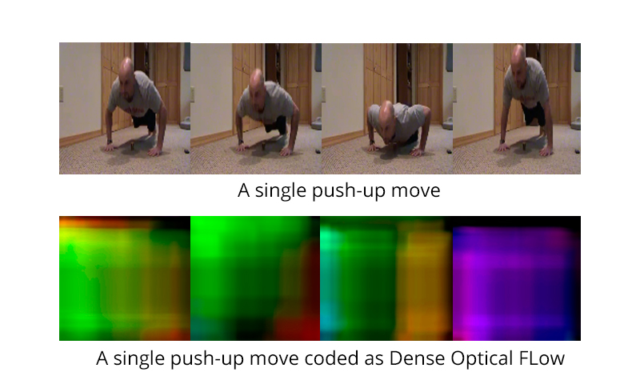
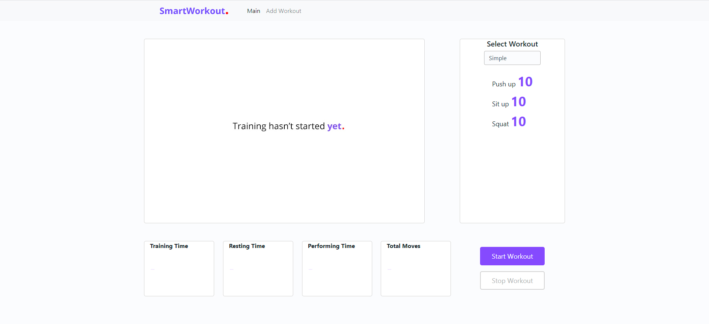

# Workout Movement Counting App using Dense Optical Flow and Convolutional Neural Networks

This repository contains my coursework as 3rd year BSc in HSE. I had to create a web app, which helps sportsmen to count their movements during the workout.
  **Also checkout my Medium writeup regarding this problem:**
[Here](https://medium.com/@artkulakov/how-i-created-the-workout-movement-counting-app-using-deep-learning-and-optical-flow-89f9d2e087ac?source=friends_link&sk=e14ec243ea1ff3bb42c3c4d05067e85c)

For this purpose I combined the Dense Optical Flow algorithm with a simple CNN network written in PyTorch. As you can see, it is pretty easy to get the idea of what one push-up is, if we look at how frames are converted to Dense Optical Flow representation in my algorithm.

Thus, Dense Optical Flow converts frames to color coded representation, and CNN solves a multiclass problem, which is to classify each frame as move down, move up or not a move.

To wrap my algorithm in something which can really work I also created a web interface using django, here is how it looks like.

To run the web app follow the instructions below.

## Instructions
1. Clone the repo and run `pip install -r requirements.txt`
2. `cd WorkoutApp/`
3. Run the app with `python manage.py runserver`
4. Choose the predefined workout and test!
